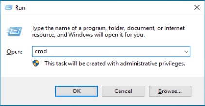
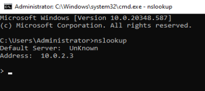
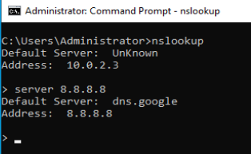
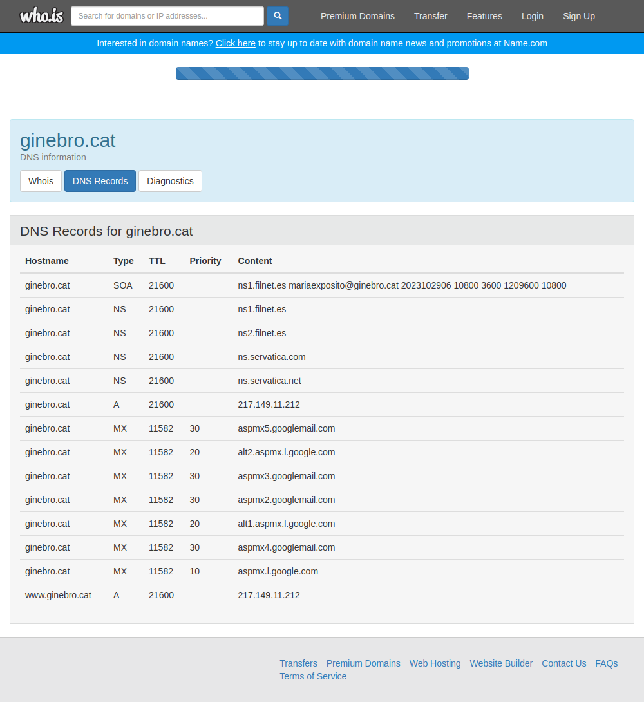

# Exemple d’un DNS - mp07-uf01-04-dns-win2020

<br>

<details><summary>pitja per mostrar l'Índex</summary>

## Índex

### [***Pas 1***: Posant-nos en situació](#pas-1-posant-nos-en-situacic3b3-1)

### [***Pas 2***: Configurar el nostre propi **servidor de ```DNS```**](#pas-4-configurar-el-nostre-propi-servidor-de-dns-1)

### [***Pas 3***: Instal·lació del servei DNS](#pas-5-installació-del-servei-dns-1)

### [***Pas 4***: Configuració del servei DNS](#pas-6-configuració-del-servei-dns-1)

### [***Pas 5***: Comprovació de la correcta configuració del servei DNS](#pas-5-comprovacic3b3-de-la-correcta-configuracic3b3-del-servei-dns-1)


</details>

<hr>
<br>


<details><summary>pitja per mostrar punts que no són passos a fer a l'activitat</summary>

<hr>

## Definició d'adreçament amb classe

<details><summary>pitja per mostrar la Definició d'adreçament amb classe</summary>


A continuació es pot veure l'adreçament de xarxa amb classe resumit.

|Classe|Adreça<br>inicial|Adreça<br>final|Màscara<br>subxarxa|
|----|:----:|:----:|:----:|
|**Class A**|**```0.0.0.0```**|**```127.255.255.255```**|**```/8```**|
|**Class B**|**```128.0.0.0```**|**```191.255.255.255```**|**```/16```**|
|**Class C**|**```192.0.0.0```**|**```223.255.255.255```**|**```/24```**|

I a la següent taula es pot veure l'adreçament de xarxa amb classe, l'espai d'adreces IPv4 de 32 bits es va dividir en 5 classes (A-E).
ND

|Classe|Bits principals|Mida del<br>camp (1)|Mida del<br>camp (2)|Nombre de<br>xarxes|Adreces<br>per xarxa|Adreces totals (3)|Adreça inicial|Adreça final|Màscara de subxarxa (4)|Notació CIDR|
|----|----|----|----|----|----|----|----|----|----|----|
|**Class A**|**```0```**|**```8```**|**```24```**|**```128 (27)```**|**```16,777,216 (224)```**|**```2,147,483,648 (231)```**|**```0.0.0.0```**|**```127.255.255.255[a]```**|**```255.0.0.0```**|**```/8```**|
|**Class B**|**```10```**|**```16```**|**```16```**|**```16,384 (214)```**|**```65,536 (216)```**|**```1,073,741,824 (230)```**|**```128.0.0.0```**|**```191.255.255.255```**|**```255.255.0.0```**|**```/16```**|
|**Class C**|**```110```**|**```24```**|**```8```**|**```2,097,152 (221)```**|**```256 (28)```**|**```536,870,912 (229)```**|**```192.0.0.0```**|**```223.255.255.255```**|**```255.255.255.0```**|**```/24```**|
|**Class D<br>(multicast)**||**```1110```**|(ND)|(ND)|(ND)|(ND)|**```268,435,456 (228)```**|**```224.0.0.0```**|**```239.255.255.255```**|(ND)|**```/4[7]```**|
|**Class E<br>(reserved)**||**```1111```**|(ND)|(ND)|(ND)|(ND)|**```268,435,456 (228)```**|**```240.0.0.0```**|**```255.255.255.255[b]```**|(ND)|(ND)|

**(1)** Mida del camp de bits del número de xarxa

**(2)** Mida del camp de bits restants

**(3)** Adreces totals a la classe

**(4)** Màscara de subxarxa predeterminada en notació decimal de punts

**(ND)** sense definir

Representació per bits
En la següent representació per bits,

* **```n```** indica un bit utilitzat per a l'**ID de xarxa**.
* **```H```** indica un bit utilitzat per a l'**identificador de l'amfitrió**.
* **```X```** indica un bit sense un propòsit especificat.

```
Class A
  0.  0.  0.  0 = 00000000.00000000.00000000.00000000
127.255.255.255 = 01111111.11111111.11111111.11111111
                  0nnnnnnn.HHHHHHHH.HHHHHHHH.HHHHHHHH

Class B
128.  0.  0.  0 = 10000000.00000000.00000000.00000000
191.255.255.255 = 10111111.11111111.11111111.11111111
                  10nnnnnn.nnnnnnnn.HHHHHHHH.HHHHHHHH

Class C
192.  0.  0.  0 = 11000000.00000000.00000000.00000000
223.255.255.255 = 11011111.11111111.11111111.11111111
                  110nnnnn.nnnnnnnn.nnnnnnnn.HHHHHHHH

Class D
224.  0.  0.  0 = 11100000.00000000.00000000.00000000
239.255.255.255 = 11101111.11111111.11111111.11111111
                  1110XXXX.XXXXXXXX.XXXXXXXX.XXXXXXXX

Class E
240.  0.  0.  0 = 11110000.00000000.00000000.00000000
255.255.255.255 = 11111111.11111111.11111111.11111111
                  1111XXXX.XXXXXXXX.XXXXXXXX.XXXXXXXX
```

Per més informació [Classful addressing definition](https://en.wikipedia.org/wiki/Classful_network#Classful_addressing_definition) 

</details>

<hr>

## Situació del **servidor** abans de començar

<details><summary>pitja per mostrar l'opció -> Situació del servidor abans de començar</summary>

### **1.** Dades del **Servidor** 

|Component|Estat|
|---|---|
|Nom del servidor|**```srv-pardo```**|
|Servidor DHCP|**instal·lat**|

### **2.** Configuració de les tres **interfícies de xarxa**:

#### **2.a** -> **1a  interfície de xarxa** la **```NAT```**:


|Interfície de xarxa|Component|Estat|
|---|---|---|
|**NAT**|**```DHCP enabled```**|**```Yes```**|
||**```IPv4 Address```**|**```10.0.2.15```**|
||**```DNS Servers```**|**```10.0.2.3```**|

#### **2.b** -> 2a **interfície de xarxa** la **```Xarxa interna```**:


|Interfície de xarxa|Component|Estat|
|---|---|---|
|**XarxaInterna**|**```DHCP enabled```**|**```No```**|
||**```IPv4 Address```**|**```172.128.8.1```**|
||**```DNS Servers```**|**```8.8.8.8```**<br>**```8.8.4.4```**|

#### **2.c** -> **3a interfície de xarxa** la **```HostOnly```**:

|Interfície de xarxa|Component|Estat|
|---|---|---|
|**HostOnly**|**```DHCP enabled```**|**```No```**|
||**```IPv4 Address```**|**```192.168.56.1```**|
||**```DNS Servers```**|**```8.8.8.8```**<br>**```8.8.4.4```**|

### **3** Configuració del **Servei de ```DHCP```** 


|Component|Estat|
|---|---|
|**nom del servidor**|**```srv-pardo```**|
|**adreça IP inicial**|**```172.128.8.100```**|
|**adreça IP final**|**```172.128.8.200```**|

#### **3.a** -> Reserves:

|Adreça MAC|Adreça ip reservada|nom reservat|
|---|---|---|
|**```0800270e32e4```**|**```172.128.8.105```**|**```localhost```**|

************************************
</details>

<hr>

## Fer consultes a un **Servidor DNS**

<details><summary>pitja per mostrar l'opció -> Fer consultes a un servidor DNS</summary>

Abans de seguir amb l'activitat cal estudiar una eina per poder conèixer com obtenir la resposta a **consultes DNS** que volem fer.

El propi sistema ja s’encarrega de fer les consultes automàticament al DNS quan ho necessita, però també és una eina que es pot utilitzar manualment, per extreure informació molt valuosa d’un domini. Motiu pel que hem d’assegurar una bona higiene del mateix.

L’eina, d’ús més habitual, per fer les consultes a un **servei de DNS** és el **```nslookup```**. És una eina de la consola de sistema, per executar-la, cal anar a la consola i escriure:

```nslookup```



I des de la línia de comandes executem la comanda **```nslookup```**, i ens obrirà l'entorn d'**```nslookup```** per poder realitzar les consultes que vulguem.



Com veiem en el nostre cas, la primera informació que ens apareix és:

```
Default server: UnKnown
Address: 10.0.2.3
```

Això ens indica que en el moment d'iniciar l'aplicació **```nslookup```**, la nostra màquina no té definit cap **servidor de DNS**.

Per indicar a quin **servidor de DNS** volem fer les consultes, li indiquem de la següent manera:

```
> server 8.8.8.8
Default server: dns.google
Address: 8.8.8.8
```

Ara si, l'aplicació **```nslookup```** ens indica que ha trobar el **servidor de DNS** amb **adreça ip** **```8.8.8.8```**.
I també ens informa de que ha detectat que es tracta del **servidor de DNS** que respon al nom **```dns.google```**.



Per tant, a partir d'ara les respostes que rebrem a les consultes que fem, seran les respostes que ens retorni  **servidor de DNS** **```dns.google```**.

Comencem per la primera consulta.

**1.** Consulta **```ginebro.cat```**

Volem coneixer quina és la resposta que ens retorna el servidor **```dns.google (8.8.8.8)```** a la pregunta sobre el servidor **```ginebro.cat```**.

```
> ginebro.cat
Server: dns.google
Address: 8.8.8.8

Non-authoritative answer:
Name:    ginebro.cat
Address: 217.149.11.212
```

Veiem que la resposta a la pregunta de quina adreça ip respon al nom **```ginebro.cat```** és **```217.149.11.212```**

No ens ho ha dit, pero aquesta consulta ha estat de **tipus ```A```**. Per defecte, si no es diu el contrari, les ***consultes DNS*** sempre son a registres de **tipus ```A```**


Important el tipus de resposta que retorna el servidor: ***Non-authoritative answer*** (**Resposta no autoritzada**), si fos autoritzada es podria arribar a "***robar***" totes les adreces que conté el **DNS**, per després utilitzar-ho amb finalitats diguem ***no massa clares***.

**2.** Consulta de **tipus ```soa```** a **```ginebro.cat```**

Per consultar al **servidor DNS**, la informació general del domini com pot ser el servidor DNS que el manté, adreça de contacte, etc. Cal canviar el tipus de consulta:

> Per modificar el tipus de registre que volem realitzar cal fer servir a comanda **```type=```** i el tipus de **registre DNS**.

```
> set type=soa
>
```

Recordem que **```soa```** és el **node superior** d’una zona (**```SOA```**, ***```S```***```tart``` ***```O```***```f``` ***```A```***```uthority```).

```
> ginebro.cat
Server: dns.google
Address: 8.8.8.8

Non-authoritative answer:

ginebro.cat
        primary name server: ns1.filnet.es
        responsible mail addr = mariaexposito.ginebro.cat
        serial  = 2023102906
        refresh = 10800 (3 hours)
        retry   = 3600 (1 hour)
        expire  = 1209600 (14 days)
        default TTL = 10800 (3 hours)
>
```

**3.** Consulta de **tipus ```mx```** a **```ginebro.cat```**

Per esbrinar quin és el servidor de correu electrònic d’un domini:

> Per modificar el tipus de registre que volem realitzar cal fer servir a comanda **```type=```** i el tipus de **registre DNS**.

```
> set type=mx
>
```

I sembla que no ha passat res. Però ara si fem la consulta ens tornarà la resposta al registre de **tipus ```mx```** del nom **```ginebro.cat```**


```
> ginebro.cat

Server: dns.google
Address: 8.8.8.8

Non-authoritative answer:
ginebro.cat	    MX preference = 30 aspmx3.googlemail.com
ginebro.cat	    MX preference = 30 aspmx5.googlemail.com
ginebro.cat	    MX preference = 10 aspmx.l.google.com
ginebro.cat	    MX preference = 30 aspmx2.googlemail.com
ginebro.cat	    MX preference = 20 alt2.aspmx.l.google.com
ginebro.cat	    MX preference = 20 alt1.aspmx.l.google.com
ginebro.cat	    MX preference = 30 aspmx4.googlemail.com
```

El resultat que retorna va relacionat per la **preferència ```MX```** i el servidor on enviar el correu.

> La **preferència ```MX```** indica a quin servidor s’ha de preguntar primer, en cas que no respongui, el segon, tercer etc. Com més petit és el número, més preferència té **```10```**, **```20```**, **```30```**, ...

**4.** Consulta de **tipus ```CNAME```** a **```mail.ginebro.cat```**

Per comprovar on apunta un sobrenom (**```CNAME```**):

```
> set type=cname
>
```

```
> mail.ginebro.cat

Server: dns.google
Address: 8.8.8.8

Non-authoritative answer:
mail.ginebro.cat 	    canonical name = ghs.google.com
```

**5.** Consulta de **tipus ```PTR```**

I en el cas que tinguem una **adreça IP** (**```PTR```**) i es vol saber a qui correspon?


```
> set type=ptr
>
```

```
> 217.149.11.212

Server: dns.google
Address: 8.8.8.8

Non-authoritative answer:
212.11.149.217.in-addr.arpa    name = srv11212.servatica.com
```

Per què ens pot ajudar aquesta eina?

* Comprovar que es resolt correctament un nom d’equip quan s’intenta accedir des d’un navegador i indica que no la troba o no existeix.
* Comprovar quins són els servidors de correu electrònic d’un domini, per després fer proves de connectivitat sobre els mateixos.
* Com es resol l’adreça IP i a quin domini pertany, per les comprovacions de reverse lookup de correu electrònic.
* Saber on està allotjat un domini concret.
* etc.

**6.** Consulta de **registres ```DNS```** a [**who.is**](who.is)

Una altra manera de veure aquesta informació és amb pàgines web com [who.is](https://who.is), que retorna la informació de **TOTS** els **registres DNS** que hi ha a **Internet**.

[https://who.is/dns/ginebro.cat](https://who.is/dns/ginebro.cat)




</details>


</details>

<hr>

## ***Pas 1***: Posant-nos en situació

En aquesta ocasió se seguiran els passos de la web [jmsolanes.net/dns/](https://www.jmsolanes.net/dns/)

Imaginem l'**Escola Ginebró SCCL**, composta per:

|Càrrec|Nom persona|
|---|---|
|**Directora pedagògica**|**Maria Exposito**|
|**Cap d'estudis**|**Marc Lurbe**|
|**Responsable de cicles d'informàtica**|**Iván Nieto**|
|**Tutor SMX1**|**Salvador Quadrades**|
|**Tutor SMX2**|**Vladi Bellavista**|
|**Professor SXA**|**Iván Nieto**|
|**Professor SXA**|**Joan Pardo**|

L'**Escola Ginebró** té les següents dades:

|Dada|Valor|
|---|---|
|**Domicili social**|**```C/ Joaquim Costa, s/n```**|
|**CP**|**```08450```**|
|**Població**|**```Llinars del Vallès```**|
|**Província**|**```Barcelona```**|
|**CIF**|**```F58241191```**|
|**Correu electrònic**|**```escola@ginebro.cat```**|

L'**Escola Ginebró** té dos edificis, un edifici per **Primaria i Secundària** i un segon edifici **EBC (Eso, Batxillerat i Cicles Formatius)**.

I també disposa d’una bústia per les cartes.


## Com es resoldria amb un servei de DNS?

Posats en situació, anem a analitzar com es podria resoldre amb un **servei de DNS**?

**1.** **Dominis**

Primer cal identificar el **domini principal** i el **domini de la família**, el seu símil **```FQDN```** podria ser:

|Domini|Valor|Comentari|
|---|---|---|
|Domini principal|**```.cat```**|En aquest cas és el **territorial**, però també hi ha<br>el **```.com```**, **```.es```**, **```.net```**, **```.org```**, etc.|
|Domini de l'escola|**```ginebro```**|On s’identifica el grup, l'escola|

**2.** **Registre DNS**

Després, s’han de donar d’alta tots els noms que intervenen (persones, portes, bústies, etc..) formant el **```FQDN```** (nom, domini de l'escola i domini principal separats per un punt); relacionant-los amb l’adreça IP (C/ Joaquim Costa, s/n de Benante - Llinars del Vallès; o bé, Edifici primaria i secundària - Llinars del Vallès - Barcelona).


Els **```HOSTS```** (**registres de tipus** **```A```**) que relacionen un nom amb una **adreça IP**, podrien ser:

#### Les **persones**:

|Nom|Adreça IP|
|---|---|
|**```mariaexposito.ginebro.cat```**|**```80.80.80.81```**|
|**```marclurbe.ginebro.cat```**|**```80.80.80.81```**|
|**```ivannieto.ginebro.cat```**|**```80.80.80.81```**|
|**```salvadorquadrades.ginebro.cat```**|**```80.80.80.81```**|
|**```vladibellavista.ginebro.cat```**|**```80.80.80.81```**|
|**```joanpardo.ginebro.cat```**|**```80.80.80.81```**|

#### Els **espais**:

|Nom|Adreça IP|
|---|---|
|**```secretaria.ginebro.cat```**|**```80.80.80.81```**|
|**```ed-primaria.ginebro.cat```**|**```80.80.80.81```**|
|**```ed-ebc.ginebro.cat```**|**```45.45.45.46```**|
 
#### Els **```SOBRENOMS```** o **àlies**

Serien els **registres** **```CNAME```** que relacionen un **sobrenom** a un **nom**, podrien ser:

|Sobrenom|Nom|
|---|---|
|**```director-pedagogic```**|**```mariaexposito.ginebro.cat```**|
|**```cap-estudis```**|**```marclurbe.ginebro.cat```**|
|**```resp-cicles-informatica```**|**```ivannieto.ginebro.cat```**|
|**```tutor-sxm1```**|**```salvadorquadrades.ginebro.cat```**|
|**```tutor-sxm2```**|**```vladibellavista.ginebro.cat```**|
|**```profe-sxa```**|**```joanpardo.ginebro.cat```**|
|**```profe-sxa-2```**|**```ivannieto.ginebro.cat```**|

#### Els **serveis especials**

Alguns **serveis especials**, com el cas del **servei de correu electrònic** (**```registre MX```**) que relaciona un domini amb el **```HOST```** on s’ha d’**entregar el correu**.

Seguint l’exemple, es pot informar al carter que quan porti una carta la deixi **a la bústia**. Que no cal que busqui a la persona en concret, ells ja s’ocuparan de distribuir-la:

|Domini|Nom|
|---|---|
|**```correu.ginebro.cat```**|**```secretaria.ginebro.cat```**|

L’encarregat de mantenir tot aquest llistat per qui el vulgui consultar és el **servei de DNS** i és útil per resoldre les adreces públiques (**Internet**) com les internes (**xarxa privada**).

## ***Pas 2***: Configurar el nostre propi **servidor de ```DNS```**


## ***Pas 3***: Instal·lació del servei DNS


Podem veure que el servidor que acabem de crear conté 4 carpetes i 2 entrades.

Les quatre carpetes son:
* ***Forward lookup zone*** (**Zones de cerca directa**): Les més habituals, a partir del nom s’assigna una adreça IP. Per dir-ho d’alguna manera, útil pels humans.

* ***Reverse lookup zone*** (**Zones de cerca inversa**): Molts cops oblidada, fa la resolució inversa, és a dir, a partir de l’adreça IP obté el nom FQDN. Per dir-ho d’alguna manera, útil per les màquines.

* ***Trust Point*** (**Punts de confiança**): Permet establir la configuració del **DNSSEC** a fi d’autenticar l’origen de les dades DNS. És una extensió molt nova que s’està començant a desplegar ara.

* ***Conditionals Forwarders*** (**Reenviadors condicionals**): Per especificar servidors de resolució DNS per a dominis concrets. Per exemple, si estic conectat per VPN a una altre empresa i vull resoldre les adreces internes d’aquesta, m’interessarà fer les peticions al seu servidor intern en comptes d’anar a Internet a buscar-ho on no ho trobar


I les dues entrades son:

* ***Root hints*** (***Traces d'arrel***): Com ja vàrem comentar a classe són els servidors **```root```**.


* ***Forwarders*** (***Reenviadors***): Son **servidors DNS** que el nostre servidor DNS pot consultar per resoldre consultes que no pot resoldre per sí mateix.


Ara ja podem procedir a fer la instal·lació d'una nova **zona de DNS**. 


ginebro.cat


Ja hem creat la nova **zona directa** **```ginebro.cat```**

Podem veure que ja hi ha dos registres creats automàticament:


El registre de tipus **``SOA``** (***```S```***```tart``` ***```O```***```f``` ***```A```***```uthority```) amb els valors:

|Data|valor|
|---|---|
|Primary server|**```srvpardo```**|
|Responsible person|Que per defecte apareix **```hostmaster```**<br>i cal que modifiquem pel nom del responsable<br>en el nostre cas per  **```joanpardo```**|


I per últim, el registre **``NS``** (**```Name Server```**) que té com a valor el nom del servidor **```srv-pardo```**.


A continuació passarem a configurar el **servidor ```DNS```**.

**Pas 1.** A sobre de la icona del servidor de **DNS**, pitja el botó dret del ratolí i
 escull l'opció **```Properties```**


**Pas 2.** A la nova finestra **```NOM DEL SERVIDOR DNS```** que s'ha obert, cal anar a la pestanya **```Interfaces```**

Veiem que està configurat perquè faci servir totes les interfícies.


Doncs cal desmarcar-les totes, llevat de la interfície que té l'adreça ip del nostre servidor. En el meu cas és la interfície que té l'adreça ip **```172.128.8.1```**.
És a dir, la que hem configurat com a **interfície de xarxa** anomenada **```Xarxa interna```**.

**Pas 3.** Pressiona el botó <kbd><u>A</u>pply</kbd>


I si tornem a veure les propietats del servidor, ja veiem que només està seleccionada la nostra **interfície de xarxa** anomenada **```Xarxa interna```**.


## ***Pas 4***: Configuració del servei DNS

### Creació dels **registres de tipus** **```A```**

Ara toca crear els **```hosts```** (o **registres de tipus** **```A```**) que relacionen un nom amb una **adreça IP**.

|Nom|Adreça IP|
|---|---|
|**```mariaexposito```**|**```80.80.80.81```**|
|**```marclurbe```**|**```80.80.80.81```**|
|**```ivannieto```**|**```80.80.80.81```**|
|**```salvadorquadrades```**|**```80.80.80.81```**|
|**```vladibellavista```**|**```80.80.80.81```**|
|**```joanpardo```**|**```80.80.80.81```**|
|**```correu```**|**```80.80.80.81```**|
|**```ed-primaria```**|**```80.80.80.81```**|
|**```ed-ebc```**|**```45.45.45.46```**|

**Pas 1.** A sobre de la icona de la **zona directa** (**Forward lookup zone**), pitja el botó dret del ratolí i
 escull l'opció **```New Host (A or AAAA) ...```**


**Pas 2.** A la nova finestra **```New Host```** que s'ha obert, cal afegir la informació del registre:

|Camp|Informació|
|---|---|
|Name|**```mariaexposito```**|
|IP Address|**```80.80.80.81```**|

## **NOTA** Confirma que l'opció de crear el registre PTR associat no està marcada, ja que encara no tenim la **zona inversa** creada.

**Pas 3.** Pressiona el botó <kbd>Add <u>H</u>ost</kbd>


**Pas 4.** A la nova finestra **```DNS```** que s'ha obert, pressiona el botó <kbd>OK</kbd>, per acceptar la confirmació de que el registre s'ha creat correctament.


**Pas 5.** Repetir els passos 1, 2, 3 i 4 per a tots els **registres de tipus ```A```**. 

Tant les persones com els espais:


### Creació dels **registres de tipus** **```CNAME```**

Ara toca crear els **```SOBRENOMS```** (o **registres de tipus** **```CNAME```**) que relacionen un nom amb un altre nom.

|Sobrenom|Nom|
|---|---|
|**```director-pedagogic```**|**```mariaexposito.ginebro.cat```**|
|**```cap-estudis```**|**```marclurbe.ginebro.cat```**|
|**```resp-cicles-informatica```**|**```ivannieto.ginebro.cat```**|
|**```tutor-sxm1```**|**```salvadorquadrades.ginebro.cat```**|
|**```tutor-sxm2```**|**```vladibellavista.ginebro.cat```**|
|**```profe-sxa```**|**```joanpardo.ginebro.cat```**|
|**```profe-sxa-2```**|**```ivannieto.ginebro.cat```**|


**Pas 1.** A sobre de la icona de la **zona directa** (**Forward lookup zone**), pitja el botó dret del ratolí i
 escull l'opció **```New Alias (CNAME) ...```**


**Pas 2.** A la nova finestra **```New Host```** que s'ha obert, cal afegir la informació del registre:

|Camp|Informació|
|---|---|
|Alias Name|**```director-pedagogic```**|
|FQDN Target|**```mariaexposito.ginebro.cat```**|


**Pas 3.** Pressiona el botó <kbd>Add <u>H</u>ost</kbd>


**Pas 4.** Repetir els passos 1, 2 i 3 per a tots els **registres de tipus ```CNAME```**. 


### Creació dels **registres de tipus** **```MX```**

Ara toca crear els **serveis especials**, com és el cas del **servei de correu electrònic** (**```registre MX```**) que relaciona un domini amb el **```HOST```** on s’ha d’**entregar el correu**.

|Sobrenom|Nom|
|---|---|
|**```correu.ginebro.cat```**|**```secretaria.ginebro.cat```**|

**Pas 1.** A sobre de la icona de la **zona directa** (**Forward lookup zone**), pitja el botó dret del ratolí i
 escull l'opció **```New Alias (CNAME) ...```**


## I ja està! Ja tenim en nostre servidor de DNS instal·lat i configurat!!

## ***Pas 5***: Comprovació de la correcta configuració del servei DNS

**Pas 1.** Desplegar de la icona de la **zona directa** (**Forward lookup zone**), i selecciona el **nom de la zona** que hem configurat, en el nostre cas **```ginebro.cat```**. 

**Pas 2.** pitja a sobre amb el botó dret del ratolí i escull l'opció **```Properties```**


**Pas 3.** A la nova finestra amb el **nom de la zona** , en el nostre cas **```ginebro.cat```**, cal anar a la pestanya **```General```**


Veiem:

* l'estat del servidor de DNS: **```Running```**

* el tipus de servidor de DNS: **```Primary```**

* el nom del fitxer de la zona: **```ginebro.cat.dns```**

**Pas 4.** A la pestanya **```Start of Authority (SOA)```**


Veiem:

* el serial number: **```22```**

* el servidor primari: **```srv-pardo.```**  (Fixeu-vos que té un punt final)

* el nom de la persona responsable: **```joanpardo```**

```
Refresh interval      = 15 minutes
Retry interval        = 10 minutes
Expire after          = 1 day
Minimum (default) TTL = 1 hour

TTL for this record: 0:1:0:0 (DDDDD:HH:MM:SS)
```
**Pas 5.** A la pestanya **```Names servers```**


Veiem:

* el **```FQDN```** del nostre servidor: **```srv-pardo.```**  (Fixeu-vos que té un punt final)


**Pas 6.** A la pestanya **```WINS```** i la pestanya **```WINS```** 


**Pas 7.** I per ultim, però no menys important, una visió global de la zona: **```ginebro.cat```**


80.80.80.81
correu.ginebro.cat


El nom del fitxer és: **```80.80.80.in-add.arpa.dns```**, i es troba ubicat a: **```c:\Windows\System32\dns```**

Amb el seguent contingut:


Doncs ara podeu afegir tants **registres ```PTR```** com **registres de tipus ```A```** que hem afegit.

I un cop afegits tots **registres ```PTR```** quedarà de la següent manera:


Tanquem i guardem el fitxer.

A continuació, procedirem a actualitzar la informació que hem afegit manualment al fitxer.


I ara ja hauran d'apareixer totes els registres

