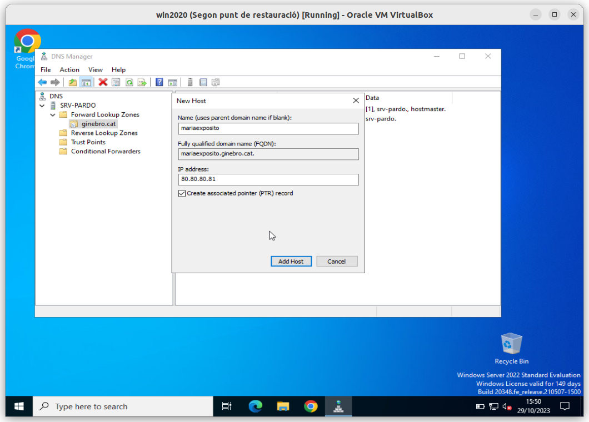
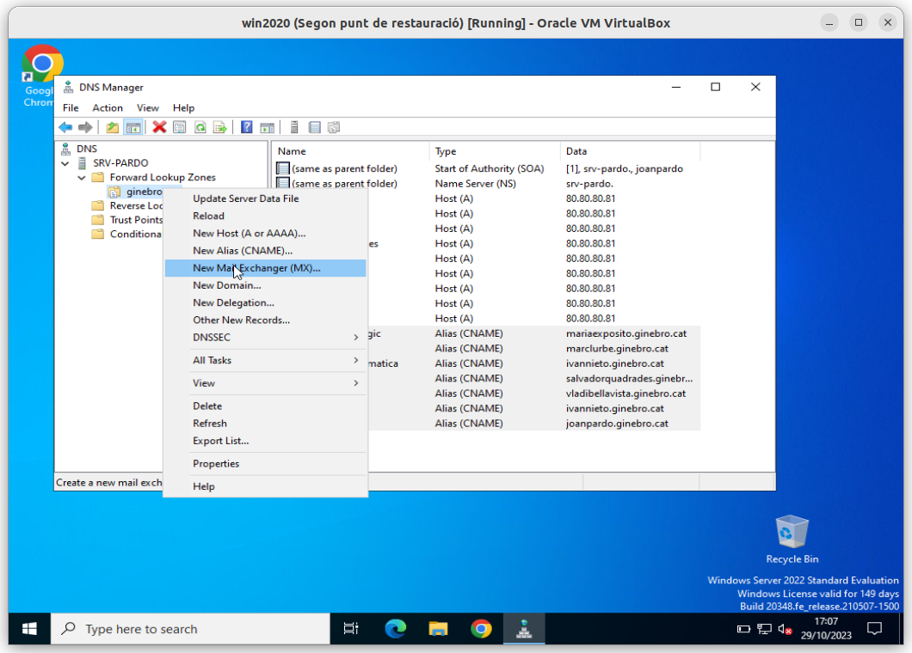

# Configuració d'un servidor DNS a Win 2020 Server TEORIA

<td class="icon">
    <div class="title">
        <h3>
            :information_source: MP07 UF01 <b>A03U - Activitat 3</b>
        </h3>
    </div>
</td>

<br>

## Índex

### [***Pas 1***: Posant-nos en situació](#pas-1-posant-nos-en-situació-1)

### [***Pas 2***: Configurar el nostre propi **servidor de ```DNS```**](#pas-2-configurar-el-nostre-propi-servidor-de-dns-1)

### [***Pas 3***: Instal·lació del servei DNS](#pas-3-installació-del-servei-dns-1)

### [***Pas 4***: Configuració del servei DNS](#pas-4-configuració-del-servei-dns-1)

### [***Pas 5***: Comprovació de la correcta configuració del servei DNS](#pas-5-comprovació-de-la-correcta-configuració-del-servei-dns-1)

<hr>

<br>

> ## Repositoris per ajudar a fer l'activitat
>
> ### [Definició d'adreçament amb classe](https://github.com/SMX-2022-2024/.github/blob/main/profile/manuals/man-dns-03-definicio-d-adrecament-amb-classe.md)
> 
> ### [Fer consultes a un **Servidor DNS**](https://github.com/SMX-2022-2024/.github/blob/main/profile/manuals/man-dns-04-consultes-a-un-servidor-dns.md)
>

<hr>

## Situació del **servidor** abans de començar

<details><summary>pitja per mostrar l'opció -> Situació del servidor abans de començar</summary>

> <hr>
>
> ### **1.** Dades del **Servidor** 
> 
> |Component|Estat|
> |---|---|
> |Nom del servidor|**```srv-pardo```**|
> |Servidor DHCP|**instal·lat**|
> 
> ### **2.** Configuració de les tres **interfícies de xarxa**:
> 
> #### **2.a** -> **1a  interfície de xarxa** la **```NAT```**:
> 
> 
> 
> |Interfície de xarxa|Component|Estat|
> |---|---|---|
> |**NAT**|**```DHCP enabled```**|**```Yes```**|
> ||**```IPv4 Address```**|**```10.0.2.15```**|
> ||**```DNS Servers```**|**```10.0.2.3```**|
> 
> #### **2.b** -> 2a **interfície de xarxa** la **```Xarxa interna```**:
> 
> 
> 
> |Interfície de xarxa|Component|Estat|
> |---|---|---|
> |**XarxaInterna**|**```DHCP enabled```**|**```No```**|
> ||**```IPv4 Address```**|**```172.128.8.1```**|
> ||**```DNS Servers```**|**```8.8.8.8```**<br>**```8.8.4.4```**|
> 
> #### **2.c** -> **3a interfície de xarxa** la **```HostOnly```**:
> 
> |Interfície de xarxa|Component|Estat|
> |---|---|---|
> |**HostOnly**|**```DHCP enabled```**|**```No```**|
> ||**```IPv4 Address```**|**```192.168.56.1```**|
> ||**```DNS Servers```**|**```8.8.8.8```**<br>**```8.8.4.4```**|
> 
> ### **3** Configuració del **Servei de ```DHCP```** 
> 
> 
> 
> |Component|Estat|
> |---|---|
> |**nom del servidor**|**```srv-pardo```**|
> |**adreça IP inicial**|**```172.128.8.100```**|
> |**adreça IP final**|**```172.128.8.200```**|
> 
> #### **3.a** -> Reserves:
> 
> |Adreça MAC|Adreça ip reservada|nom reservat|
> |---|---|---|
> |**```0800270e32e4```**|**```172.128.8.105```**|**```localhost```**|
> <hr>
> 

</details>

<hr>

## ***Pas 1***: Posant-nos en situació

#### [Tornar a l'*Ìndex*](#índex)

En aquesta ocasió se seguiran els passos de la web [jmsolanes.net/dns/](https://www.jmsolanes.net/dns/)

Imaginem l'**Escola Ginebró SCCL**, composta per:

|Càrrec|Nom persona|
|---|---|
|**Directora pedagògica**|**Maria Exposito**|
|**Cap d'estudis**|**Marc Lurbe**|
|**Responsable de cicles d'informàtica**|**Iván Nieto**|
|**Tutor SMX1**|**Salvador Quadrades**|
|**Tutor SMX2**|**Vladi Bellavista**|
|**Professor SXA**|**Iván Nieto**|
|**Professor SXA**|**Joan Pardo**|

L'**Escola Ginebró** té les següents dades:

|Dada|Valor|
|---|---|
|**Domicili social**|**```C/ Joaquim Costa, s/n```**|
|**CP**|**```08450```**|
|**Població**|**```Llinars del Vallès```**|
|**Província**|**```Barcelona```**|
|**CIF**|**```F58241191```**|
|**Correu electrònic**|**```escola@ginebro.cat```**|

L'**Escola Ginebró** té dos edificis, un edifici per **Primaria i Secundària** i un segon edifici **EBC (Eso, Batxillerat i Cicles Formatius)**.

I també disposa d’una bústia per les cartes.


## Com es resoldria amb un servei de DNS?

Posats en situació, anem a analitzar com es podria resoldre amb un **servei de DNS**?

**1.** **Dominis**

Primer cal identificar el **domini principal** i el **domini de la família**, el seu símil **```FQDN```** podria ser:

|Domini|Valor|Comentari|
|---|---|---|
|Domini principal|**```.cat```**|En aquest cas és el **territorial**, però també hi ha<br>el **```.com```**, **```.es```**, **```.net```**, **```.org```**, etc.|
|Domini de l'escola|**```ginebro```**|On s’identifica el grup, l'escola|

**2.** **Registre DNS**

Després, s’han de donar d’alta tots els noms que intervenen (persones, portes, bústies, etc..) formant el **```FQDN```** (nom, domini de l'escola i domini principal separats per un punt); relacionant-los amb l’adreça IP (C/ Joaquim Costa, s/n de Benante - Llinars del Vallès; o bé, Edifici primaria i secundària - Llinars del Vallès - Barcelona).


Els **```HOSTS```** (**registres de tipus** **```A```**) que relacionen un nom amb una **adreça IP**, podrien ser:

#### Les **persones**:

|Nom|Adreça IP|
|---|---|
|**```mariaexposito.ginebro.cat```**|**```80.80.80.81```**|
|**```marclurbe.ginebro.cat```**|**```80.80.80.81```**|
|**```ivannieto.ginebro.cat```**|**```80.80.80.81```**|
|**```salvadorquadrades.ginebro.cat```**|**```80.80.80.81```**|
|**```vladibellavista.ginebro.cat```**|**```80.80.80.81```**|
|**```joanpardo.ginebro.cat```**|**```80.80.80.81```**|

#### Els **espais**:

|Nom|Adreça IP|
|---|---|
|**```secretaria.ginebro.cat```**|**```80.80.80.81```**|
|**```ed-primaria.ginebro.cat```**|**```80.80.80.81```**|
|**```ed-ebc.ginebro.cat```**|**```45.45.45.46```**|
 
#### Els **```SOBRENOMS```** o **àlies**

Serien els **registres** **```CNAME```** que relacionen un **sobrenom** a un **nom**, podrien ser:

|Sobrenom|Nom|
|---|---|
|**```director-pedagogic```**|**```mariaexposito.ginebro.cat```**|
|**```cap-estudis```**|**```marclurbe.ginebro.cat```**|
|**```resp-cicles-informatica```**|**```ivannieto.ginebro.cat```**|
|**```tutor-sxm1```**|**```salvadorquadrades.ginebro.cat```**|
|**```tutor-sxm2```**|**```vladibellavista.ginebro.cat```**|
|**```profe-sxa```**|**```joanpardo.ginebro.cat```**|
|**```profe-sxa-2```**|**```ivannieto.ginebro.cat```**|

#### Els **serveis especials**

Alguns **serveis especials**, com el cas del **servei de correu electrònic** (**```registre MX```**) que relaciona un domini amb el **```HOST```** on s’ha d’**entregar el correu**.

Seguint l’exemple, es pot informar al carter que quan porti una carta la deixi **a la bústia**. Que no cal que busqui a la persona en concret, ells ja s’ocuparan de distribuir-la:

|Domini|Nom|
|---|---|
|**```correu.ginebro.cat```**|**```secretaria.ginebro.cat```**|

L’encarregat de mantenir tot aquest llistat per qui el vulgui consultar és el **servei de DNS** i és útil per resoldre les adreces públiques (**Internet**) com les internes (**xarxa privada**).

## ***Pas 2***: Configurar el nostre propi **servidor de ```DNS```**

#### [Tornar a l'Ìndex](#índex)


## ***Pas 3***: Instal·lació del servei DNS

#### [Tornar a l'Ìndex](#índex)


Podem veure que el servidor que acabem de crear conté 4 carpetes i 2 entrades.

Les quatre carpetes son:
* ***Forward lookup zone*** (**Zones de cerca directa**): Les més habituals, a partir del nom s’assigna una adreça IP. Per dir-ho d’alguna manera, útil pels humans.

* ***Reverse lookup zone*** (**Zones de cerca inversa**): Molts cops oblidada, fa la resolució inversa, és a dir, a partir de l’adreça IP obté el nom FQDN. Per dir-ho d’alguna manera, útil per les màquines.

* ***Trust Point*** (**Punts de confiança**): Permet establir la configuració del **DNSSEC** a fi d’autenticar l’origen de les dades DNS. És una extensió molt nova que s’està començant a desplegar ara.

* ***Conditionals Forwarders*** (**Reenviadors condicionals**): Per especificar servidors de resolució DNS per a dominis concrets. Per exemple, si estic conectat per VPN a una altre empresa i vull resoldre les adreces internes d’aquesta, m’interessarà fer les peticions al seu servidor intern en comptes d’anar a Internet a buscar-ho on no ho trobar


I les dues entrades son:

* ***Root hints*** (***Traces d'arrel***): Com ja vàrem comentar a classe són els servidors **```root```**.


* ***Forwarders*** (***Reenviadors***): Son **servidors DNS** que el nostre servidor DNS pot consultar per resoldre consultes que no pot resoldre per sí mateix.


Ara ja podem procedir a fer la instal·lació d'una nova **zona de DNS**. 


ginebro.cat


Ja hem creat la nova **zona directa** **```ginebro.cat```**

Podem veure que ja hi ha dos registres creats automàticament:


El registre de tipus **``SOA``** (***```S```***```tart``` ***```O```***```f``` ***```A```***```uthority```) amb els valors:

|Data|valor|
|---|---|
|Primary server|**```srvpardo```**|
|Responsible person|Que per defecte apareix **```hostmaster```**<br>i cal que modifiquem pel nom del responsable<br>en el nostre cas per  **```joanpardo```**|


I per últim, el registre **``NS``** (**```Name Server```**) que té com a valor el nom del servidor **```srv-pardo```**.


A continuació passarem a configurar el **servidor ```DNS```**.

**Pas 1.** A sobre de la icona del servidor de **DNS**, pitja el botó dret del ratolí i
 escull l'opció **```Properties```**


**Pas 2.** A la nova finestra **```NOM DEL SERVIDOR DNS```** que s'ha obert, cal anar a la pestanya **```Interfaces```**

Veiem que està configurat perquè faci servir totes les interfícies.


Doncs cal desmarcar-les totes, llevat de la interfície que té l'adreça ip del nostre servidor. En el meu cas és la interfície que té l'adreça ip **```172.128.8.1```**.
És a dir, la que hem configurat com a **interfície de xarxa** anomenada **```Xarxa interna```**.

**Pas 3.** Pressiona el botó <kbd><u>A</u>pply</kbd>


I si tornem a veure les propietats del servidor, ja veiem que només està seleccionada la nostra **interfície de xarxa** anomenada **```Xarxa interna```**.


## ***Pas 4***: Configuració del servei DNS

#### [Tornar a l'Ìndex](#índex)

### Creació dels **registres de tipus** **```A```**

Ara toca crear els **```hosts```** (o **registres de tipus** **```A```**) que relacionen un nom amb una **adreça IP**.

|Nom|Adreça IP|
|---|---|
|**```mariaexposito```**|**```80.80.80.81```**|
|**```marclurbe```**|**```80.80.80.81```**|
|**```ivannieto```**|**```80.80.80.81```**|
|**```salvadorquadrades```**|**```80.80.80.81```**|
|**```vladibellavista```**|**```80.80.80.81```**|
|**```joanpardo```**|**```80.80.80.81```**|
|**```correu```**|**```80.80.80.81```**|
|**```ed-primaria```**|**```80.80.80.81```**|
|**```ed-ebc```**|**```45.45.45.46```**|

**Pas 1.** A sobre de la icona de la **zona directa** (**Forward lookup zone**), pitja el botó dret del ratolí i
 escull l'opció **```New Host (A or AAAA) ...```**


**Pas 2.** A la nova finestra **```New Host```** que s'ha obert, cal afegir la informació del registre:

|Camp|Informació|
|---|---|
|Name|**```mariaexposito```**|
|IP Address|**```80.80.80.81```**|

## **NOTA** Confirma que l'opció de crear el registre PTR associat no està marcada, ja que encara no tenim la **zona inversa** creada.

**Pas 3.** Pressiona el botó <kbd>Add <u>H</u>ost</kbd>



**Pas 4.** A la nova finestra **```DNS```** que s'ha obert, pressiona el botó <kbd>OK</kbd>, per acceptar la confirmació de que el registre s'ha creat correctament.


**Pas 5.** Repetir els passos 1, 2, 3 i 4 per a tots els **registres de tipus ```A```**. 

Tant les persones com els espais:


### Creació dels **registres de tipus** **```CNAME```**

Ara toca crear els **```SOBRENOMS```** (o **registres de tipus** **```CNAME```**) que relacionen un nom amb un altre nom.

|Sobrenom|Nom|
|---|---|
|**```director-pedagogic```**|**```mariaexposito.ginebro.cat```**|
|**```cap-estudis```**|**```marclurbe.ginebro.cat```**|
|**```resp-cicles-informatica```**|**```ivannieto.ginebro.cat```**|
|**```tutor-sxm1```**|**```salvadorquadrades.ginebro.cat```**|
|**```tutor-sxm2```**|**```vladibellavista.ginebro.cat```**|
|**```profe-sxa```**|**```joanpardo.ginebro.cat```**|
|**```profe-sxa-2```**|**```ivannieto.ginebro.cat```**|


**Pas 1.** A sobre de la icona de la **zona directa** (**Forward lookup zone**), pitja el botó dret del ratolí i
 escull l'opció **```New Alias (CNAME) ...```**


**Pas 2.** A la nova finestra **```New Host```** que s'ha obert, cal afegir la informació del registre:

|Camp|Informació|
|---|---|
|Alias Name|**```director-pedagogic```**|
|FQDN Target|**```mariaexposito.ginebro.cat```**|


**Pas 3.** Pressiona el botó <kbd>Add <u>H</u>ost</kbd>


**Pas 4.** Repetir els passos 1, 2 i 3 per a tots els **registres de tipus ```CNAME```**. 


### Creació dels **registres de tipus** **```MX```**

Ara toca crear els **serveis especials**, com és el cas del **servei de correu electrònic** (**```registre MX```**) que relaciona un domini amb el **```HOST```** on s’ha d’**entregar el correu**.

|Sobrenom|Nom|
|---|---|
|**```correu.ginebro.cat```**|**```secretaria.ginebro.cat```**|

**Pas 1.** A sobre de la icona de la **zona directa** (**Forward lookup zone**), pitja el botó dret del ratolí i
 escull l'opció **```New Alias (CNAME) ...```**




## I ja està! Ja tenim en nostre servidor de DNS instal·lat i configurat!!

## ***Pas 5***: Comprovació de la correcta configuració del **servei ```DNS```**

#### [Tornar a l'Ìndex](#índex)

**Pas 1.** Desplegar de la icona de la **zona directa** (**Forward lookup zone**), i selecciona el **nom de la zona** que hem configurat, en el nostre cas **```ginebro.cat```**. 

**Pas 2.** pitja a sobre amb el botó dret del ratolí i escull l'opció **```Properties```**


**Pas 3.** A la nova finestra amb el **nom de la zona** , en el nostre cas **```ginebro.cat```**, cal anar a la pestanya **```General```**


Veiem:

* l'estat del servidor de DNS: **```Running```**

* el tipus de servidor de DNS: **```Primary```**

* el nom del fitxer de la zona: **```ginebro.cat.dns```**

**Pas 4.** A la pestanya **```Start of Authority (SOA)```**


Veiem:

* el serial number: **```22```**

* el servidor primari: **```srv-pardo.```**  (Fixeu-vos que té un punt final)

* el nom de la persona responsable: **```joanpardo```**

```
Refresh interval      = 15 minutes
Retry interval        = 10 minutes
Expire after          = 1 day
Minimum (default) TTL = 1 hour

TTL for this record: 0:1:0:0 (DDDDD:HH:MM:SS)
```
**Pas 5.** A la pestanya **```Names servers```**


Veiem:

* el **```FQDN```** del nostre servidor: **```srv-pardo.```**  (Fixeu-vos que té un punt final)


**Pas 6.** A la pestanya **```WINS```** i la pestanya **```WINS```** 


**Pas 7.** I per ultim, però no menys important, una visió global de la zona: **```ginebro.cat```**


80.80.80.81
correu.ginebro.cat


El nom del fitxer és: **```80.80.80.in-add.arpa.dns```**, i es troba ubicat a: **```c:\Windows\System32\dns```**

Amb el seguent contingut:


Doncs ara podeu afegir tants **registres ```PTR```** com **registres de tipus ```A```** que hem afegit.

I un cop afegits tots **registres ```PTR```** quedarà de la següent manera:


Tanquem i guardem el fitxer.

A continuació, procedirem a actualitzar la informació que hem afegit manualment al fitxer.


I ara ja hauran d'apareixer totes els registres

